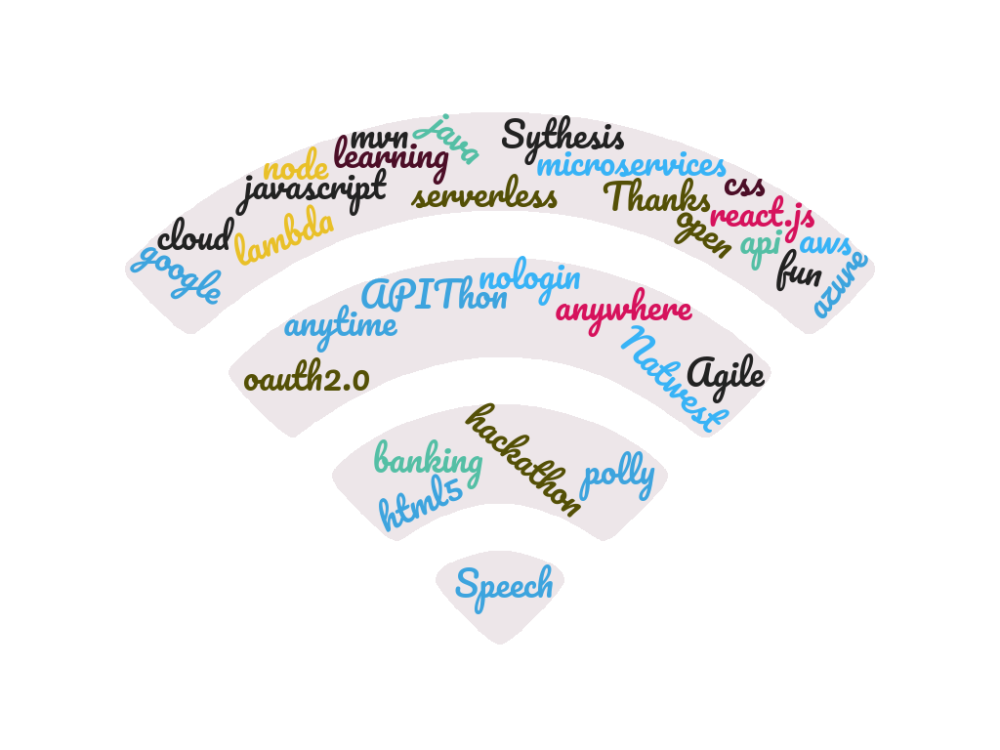

## RBS Open Banking Hackathon July 2020
#### Team name: Cyber Renderer
#### Theme: NuV - Natwest under Voice
#### Concepts: Open Banking and Assistive Technologies
#### github: dpcyberr (https://github.com/dpcyberr/openbaking-hackathon-rbs-jul2020-nuv.git)
###### Contributors: Devendra Prasad (prasadf, Enterprise Solution) & Anand Kalyankar (kalyand, Core Banking)
###### Mentor: Akriti Katiyar, Natwest Markets
###### Thanks: Neeraj Goyal, Manoj Garg, Dheeraj Jaggi, Shivi & entire Hackathon Team

###linux / windows - without sudo 
* sudo npm install nodemon -g
* sudo npm install http-server -g

locate where package.json in in openbanking-node-sdk folder and do npm install to install dependencies needed by the app server

we have used express for rest and points request-promise-native primarily for exposing app as rest endpoint and calling uris

###open banking api sandbox
we have used following url to get connected to sandbox [https://developer.rbs.useinfinite.io/](https://developer.rbs.useinfinite.io/) On the [dashboard](https://developer.rbs.useinfinite.io/dashboard) 

have used dpcyber team/app and applied template data on this

we have also activated programatic access to hit the apis

* Under my apps, APIs -> Version 3.1.0 of CMA9 Accounts API, click 'Request Access'...
* configure / Enable 'Allow <reduced> security' and 'Allow Tpp' to programmatically authorise User consents'

###start local server in current directory where index.html is located under OB_Proto_SRC dir
* http-server -a localhost -p 3000
* goto localhost:6200

###resolving CORS issue in browser to allowing these 2 services running on 3000 & 6200, download and install MOESIF 
* https://chrome.google.com/webstore/detail/moesif-orign-cors-changer/digfbfaphojjndkpccljibejjbppifbc?hl=en

###start local server in backend under openbanking-node-sdk where index.js is
* npm run startx or npm run start:automatic or nodemon index.js or node index.js
** This is the default option and requires the `allowProgrammaticAuthorisation` option to be turned on in the sandbox app settings.
** as of now the app works for any one customerid which is being set in servers config.json file 
## Configuration
The `config.json` file needs to contain some key information to allow the example app to communicate with the sandbox api:
* `clientId` & `clientSecret`: these keys need to match the app configuration. They are sent to the sandbox's API during the authentication process.
* `teamDomain`: this domain needs to match the domain specified in the team configuration. For a WebApp this should be the domain that the app is hosted on to allow redirection after manual authentication. For a CLI app it can just be a fake domain.
***** `customerNumber`: this is the customer whose account information you wish to request. You can pick one from the test data you have uploaded to the sandbox under Dashboard -> team -> Test Data (this is only used for [automatic authentication](#1-automatic-authorisation)).
* `proxy`: optionally set a proxy for http requests to go through, or null for no proxy. 
* eg config.json for app is as follows
{
	"clientId": "<copy from dashboard>",
	"clientSecret": "<copy from dashboard>",
	"teamDomain": "dpcyber.com",
	"customerNumber": "231490383323",
	"financeId": "0015800000jfwB4AAI",
	"proxy": null
}

###demo app is here
* app with static resources(no backend server needed to view it): https://dpresume.com/nuv/
* https://dpresume.com/nuv/resources/demo.webm

###few example uri when node server starts at 6200, these endpoints exposed for the customerid: 231490383323
* http://localhost:6200/api/cust
* http://localhost:6200/api/accounts
* http://localhost:6200/api/offers
* http://localhost:6200/api/summary
* http://localhost:6200/api/moratorium
* http://localhost:6200/api/top5
* http://localhost:6200/api/transactions/*/b048e556-e550-43d2-9881-b33b7809f76f
* http://localhost:6200/api/transactions/*/fef7dc2d-0cf3-44e3-a115-3ff4c66248a9
* http://localhost:6200/api/insight/b048e556-e550-43d2-9881-b33b7809f76f

##TECHNICAL Details - Backend (dir openbanking-node-sdk):
* index.js: 
* api.js: 
* helper.js: 
* exposeREST.js: 
* narrativeInsights.js: 

##TECHNICAL Details - Frontend (dir OB_Proto_SRC):
* index.html: 
* custom.js:
* main.css:
* resources: 
* accountsEndpoints: 

